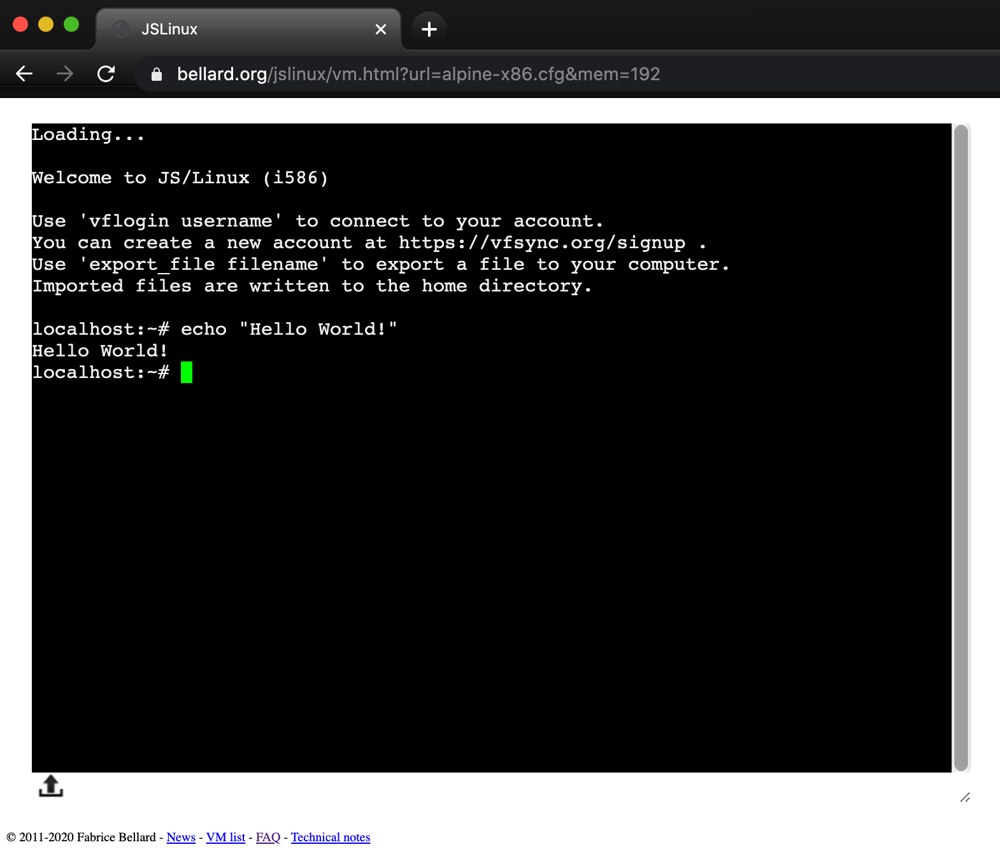
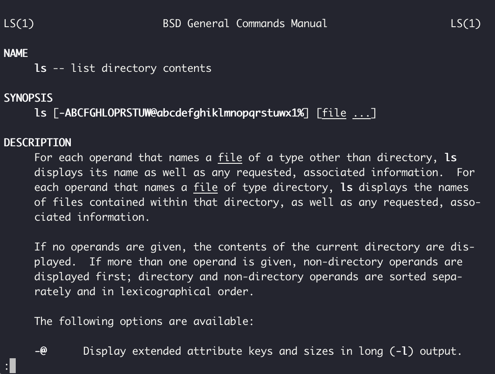
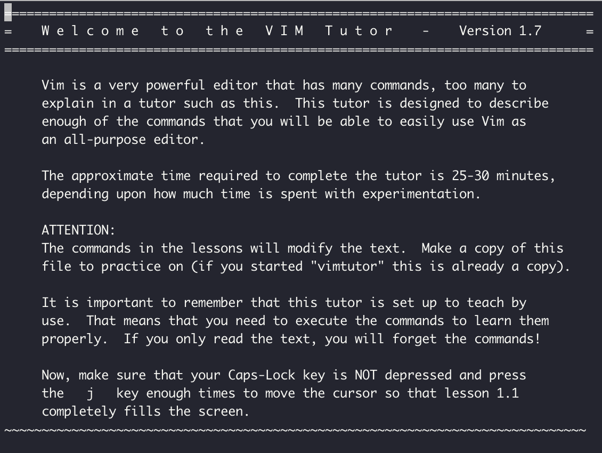

# How To Start Using the Command Line

The command line is a must for any real programmer and since data practitioners are writing software programs - it only makes sense that you need to learn it, and learn it well you shall!

Great skill in the command line is highly sought after in data science roles and is a hard requirement for any Data or ML Engineer roles.

## Pre-Flight Setup

There are a few online options where you can try out the Command Line without any risk of destroying your machine.

Please try out any of the below links listed in order of preference for a virtual environment playground:

### JS Linux

https://bellard.org/jslinux/vm.html?url=alpine-x86.cfg&mem=192



### Play With Docker

Play With Docker is also a very popular playground but will require an additional sign-up step (highly recommended!):

* https://labs.play-with-docker.com/ (requires Docker ID registration - highly recommended to sign up!)

Once you get into the playground you will just need to click on the `ADD NEW INSTANCE` button on the left to spin up a terminal to use.


### Warning

Please feel free to also try these commands on your local machine but be extra careful and follow the rules otherwise things could go seriously (and irrepairably wrong!!!)

Note: On Windows - make sure you've installed Git and `Git Bash` as all the following commands will be for Unix shell only!

True Mac users will make use of spotlight search to open a terminal: hold the apple command key and hit the spacebar to bring up spotlight search and type in `terminal`

# Rules

**DO NOT Copy Paste Commands Blindly**

Do not **EVER** blindly copy and paste commands into the terminal - you can actually destroy your machine and there is no ctrl-z!!!

**You Must Run All The Commands**

Learning the CLI is done by doing - you will not learn it successfully unless you run commands.

I recommend you type all of the commands to start getting used to it - you will use these commands A LOT!

This tutorial is sequential and is meant to be consumed as a continuous thread of commands - if you choose to jump around, please be sure to keep an eye out for files or folders created in above steps!

# Overview

In this CLI Crash Course based off `Learn the CLI The Hard Way` by Zed Shaw we covered the basics of the following commands:

* [pwd](#pwd)
* [hostname](#hostname)
* [mkdir](#mkdir)
* [cd](#cd)
* [ls](#ls)
* [rmdir](#rmdir)
* [touch](#touch)
* [cp](#cp)
* [mv](#mv)
* [echo](#echo)
* [less](#less)
* [cat](#cat)
* [rm](#rm)
* [Pipes](#Pipes)
* [Redirects](#Redirects)
* [Wildcards](#Wildcards)
* [find](#find)
* [grep](#grep)
* [man](#man)
* [env](#env)
* [export](#export)
* [exit](#exit)

# Command Line Keywords

## pwd

Once you are in the terminal - you can use `pwd` to identify where you are inside the filesystem

```Bash
$ pwd
/Users/Danny
```

## hostname

Ever wondered what your computer name was? You can run `hostname` to find out!

This also works when you are working on a remote server via `ssh` access - more on this later!

```Bash
$ hostname
Dannys-Macbook-Pro
```

## mkdir

You know how normally when you are clicking around in Finder or in the Explorer and you need to hit the "New Folder" button to create a new folder?

Well in the shell, you can simply use `mkdir` to make a directory i.e. a folder inside your current location (remember `pwd`?)

```Bash
$ mkdir temp
```

## cd

Ok so you have created a temp folder, cool. Let's navigate to this new folder, or in other words change directory.

Let's `cd` into this temp folder now and also run `pwd` to make sure we are where we need to be

```Bash
$ cd temp
$ pwd
/Users/Danny/temp
```

Remember the directory where your terminal entered? That is usually your home directory and we can usually refer to this in the shell by typing `~`

So to go home - we can simply run the following (be sure to check where you are in the end!):

```Bash
$ cd ~
$ pwd
/Users/Danny
```

## ls

So if you've already got a few things in your home directory, we can easily list out the contents using the `ls` command

```Bash
$ ls
temp
some-file.txt
some-other-file.txt
...
many-other-folders-etc
```

Let's move into the temp folder we created before and confirm that there is nothing in there shall we?

```Bash
$ cd temp
$ ls

```

## rmdir

So now that we are in the `temp` folder - let's create a new folder with the name of your enemy. I'm going to use `The-Joker` for mine because I'm Batman.

Let's also check just exactly where we are using `pwd` and also that this new folder has actually been created by using `ls`

```Bash
$ mkdir The-Joker
$ pwd
/Users/Danny/temp
$ ls
The-Joker
```

Ok awesome - now let's delete that directory that we've just created using the `rmdir` command and check the contents of our current directory again using `ls` - there should be nothing!

```Bash
$ rmdir The-Joker
$ ls

```

## touch

Let's learn how to create empty files - there are many reasons why we might want to do this but we will cover these reasons later so we can stay on track now!

Firstly do you remember where we are? Also let's create a new file called `sushi` because it's my favourite food - then let's also check that this new file is in the directory.

```Bash
$ pwd
/Users/Danny/temp
$ touch sushi
$ ls
sushi
```

## cp

So since I love sushi so much - I want to copy it and create a new file called `sushi-copy` - feel free to call your copied food whatever you like.

Let's check whether our files exist too - you know the drill!

```Bash
$ cp sushi sushi-copy
$ ls
sushi
sushi-copy
```

## mv


So `mv` is a funny command because we can use this not only to move files and folders around, but we can also use it rename them - weird right!

Firstly - let's rename the copy of our favourite food with `-1` after it - I'm going to change my copy to `sushi-1`

```Bash
$ mv sushi-copy sushi-1
$ ls
sushi
sushi-1
```

Ok let's now try moving our file too!

Let's say we want to move `sushi` into a new `favourite_foods` folder.

We can use the `mv` command to do this, let's also `cd` into the `fav_foods` folder so we can check what's inside using `ls`

```Bash
$ mv sushi fav_foods
$ cd fav_foods
-bash: cd: fav_foods: Not a directory
```

Wait....what just happened? Didn't we just move `sushi` into our `fav_foods` folder?

Oh yeah - we didn't create the folder first, D'oh! Let's rename our dodgy `fav_foods` file back to `sushi` using `mv`

```Bash
$ mv fav_foods sushi
$ ls
sushi
sushi-1
```

Now let's try that again - let's create a new folder called `fav_foods` first to avoid that mistake we just made. Let's try to `cd` into `fav_foods` and check out what's inside.

Also one more thing to note - when we `mv` items to a folder - we want to be explicit with our commands, to specify that we indeed want to move `sushi` into the `fav_foods` folder - we can append a `/` to the end of `fav_foods` to explicitly state this path. This is very important when we are moving files around different locations!

```Bash
$ mkdir fav_foods
$ mv sushi fav_foods/
$ cd fav_foods
$ ls
sushi
```

Also instead of always having to `cd` into folders to find out what's inside - we can also use `ls` with a target folder or path to see what's inside without changing directory.

Let's first move up one level - oh we haven't covered this one also...

We can `cd` up one level by running the following:

```Bash
$ cd ..
$ pwd
/Users/Danny/temp
```

Ok now that we're back in the `temp` folder - we can try running the `ls` with `fav_foods` as the target and confirm that we haven't changed our location by re-running `pwd` after

```Bash
$ ls temp
sushi
$ pwd
/Users/Danny/temp
```

Well done so far - you've done a great job to keep up! 😎

## echo

`echo` is the equivalent of `print` in any other language like `Python` where it can be used to print statements to stdout

Let's do the `print("Hello World!")` example in the command line!

```Bash
$ echo Hello World!
Hello World!
```

## less

For this section we will create a new file called `menu.txt` using any text editor you like.

You can copy and paste this following text into the file and save it directly inside the `temp` folder.

OR if you want to try hard-mode you can use the `>` redirection command with `echo` to redirect the printed output from `stdout` to a new file `menu.txt` 

```
This is a Sushi menu
```

**Hard-mode**

```Bash
$ echo This is a Sushi menu > menu.txt
```

Redirects are really cool and we will use them more soon!

Ok now onto the main course the `less` command - we can use this to view the contents of a file...but there is a catch!

When you run the following in the terminal - it will take you into a different type of console

```Bash
$ less menu.txt
```

```Bash
This is a Sushi menu
menu.txt (END)
```

To exit this `less` console - you simply need to hit the `q` key and get back into the regular terminal - phew!

So `less` is one way we can view file contents - but what if there was a better way...

## cat

`cat` is an alternative to view the file contents - however the contents are streamed to stdout just like when we use `echo` to print something.

```Bash
$ cat menu.txt
This is a Sushi menu
```

We can also use `cat` and the append version of the redirect command `>>` to add additional lines to the `menu.txt` file.

Firstly, let's create a `menu_item.txt` file with the following contents using `echo` on hard-mode and `cat` the contents to verify what text we have

```Bash
$ echo Very yummy sushi - 10 > menu_item.txt
$ cat menu_item.txt
Very yummy sushi - 10
```

Now let's use that redirect command and append the contents of `menu_item.txt` to the original `menu.txt` file.

We need to make sure to use `>>` and not the single `>` as the latter will overwrite the file - just like we showed in the previous `less` tutorial.

Let's also finally `cat` out the contents of `menu.txt` to see what's inside.

```Bash
$ cat menu_item.txt >> menu.txt
$ cat menu.txt
This is a Sushi menu
Very yummy sushi - 10
```

## rm

**Warning - Here be Dangerous Waters!!!**

Ok - let me preface this section: DO NOT BLINDLY COPY PASTA HERE - seriously bad things will happen if you do...there is no undo in the command line!!!

Repeat - be super careful here - I don't want you to destroy your machine!!!

We can remove files with the `rm` command. For example - let's delete that `menu_item.txt` file we created in the previous `cat` tutorial.

Oh let's also remind ourselves where we are again in the directory and also check that indeed the `menu_item.txt` file is deleted

```Bash
$ pwd
/Users/Danny/temp
$ rm menu_item.txt
$ ls
fav_foods
menu.txt
sushi-1
```

Ok here is where things get a bit more dicey - we are going to now recursively remove the `fav_foods` folder. Reminder - this could go seriously wrong so be super careful!!!

When we want to remove folders, previously we used the `rmdir` command - which works quite well when the folder is empty - but it will not work when there are contents inside the target folder!

```Bash
$ rmdir fav_foods
rmdir: fav_foods: Directory not empty
```


Instead we will need to use the recursive option with `rm -r` to remove the file contents also. Again - be careful!!!!!!

Now let's try again to carefully delete that `fav_foods` folder and list the contents of our current directory again

```Bash
$ rm -r fav_foods
$ ls
menu.txt
sushi-1
```

Phew - hope nothing went wrong with that! Please be careul with the recursive remove command as you could very easily delete things which should not be deleted! PLEASE KEEP THIS IN MIND WHENEVER YOU USE `rm` in the future!!!

## Pipes

So we learnt about redirects `>` and `>>` earlier where we redirect `stdout` to a target file and either replace or append respectively.

Now let's learn about the pipe operator `|` which allows us to pass `stdout` to another command.

For example let's say we would like to `cat` the contents of `menu.txt` and use `grep` to only return the lines which include the word "yummy" - more on `grep` later!

```Bash
$ cat menu.txt | grep yummy
Very yummy sushi - 10
```

Pipes are very very useful and we will show you a few more examples soon!

## Redirects

Before we learnt redirects from left to right - but we can also redirect from right to left using `<`

```Bash
$ cat < menu.txt
This is a Sushi menu
Very yummy sushi - 10
```

It might seem a trivial usage for now - but in time we will see some more useful examples of this other directional redirect!

## Wildcards

Using the asterisk symbol `*` in a command represents anything!

For example - let's list all `.txt` files in our directory

```Bash
$ ls *.txt
menu.txt
```

We can also use this `*` wildcard to delete files too - BE SUPER CAREFUL HERE!!!

In the next block, we delete all `.txt` files in our current directory and verify that indeed we only delete the text files!

```Bash
$ rm *.txt
$ ls
sushi-1
```

One FINAL thing - you can probably see that you can also delete everything in your folder too...let's do this together but remember - YOU NEED TO BE SUPER CAREFUL!!!!!!!!!!

First of all - let's make sure we are where we want to be, inside the `temp` folder!!!

```Bash
$ pwd
/Users/Danny/temp
```

So I probably don't need to tell you this - but if you are in any other location - YOU WILL DELETE SOMETHING IF YOU RUN THE NEXT COMMANDS!!!

PLEASE BE SUPER CAREFUL AND DOUBLE/TRIPLE CHECK WHERE YOU ARE!!!

Ok great - now let's CAREFULLY run the delete command and validate that indeed that final final is blown away from the `temp` folder!

```Bash
$ rm *
$ ls
$ pwd
/Users/Danny/temp
```

Ok phew - let's move on! Please again - anytime you run the `rm` command be SUPER CAREFUL, especially when you are using wildcards `*` - this is super important! I seriously cannot stress this enough - the last thing you want to do when working on an actual server is to delete EVERYTHING!!!!!!!!!!!

Well done to get down so far!

## find

In the Finder or Windows Explorer you may have noticed a search box where you can enter filenames and the search utility will do it's thing and return you the closest items. In the background, the `find` command is doing all the heavy lifting!

First off let's create a few empty `.txt` files inside the `temp` directory that we can search through - do you remember how to do that?

```Bash
$ touch food.txt drinks.txt desserts.txt
$ ls
desserts.txt  drinks.txt  food.txt
```

Woah did I blow your mind? You can pass in multiple arguments to `touch` to create multiple files all at once. Let's create a few more files, but this time we'll use `.csv` instead.

```Bash
$ touch customers.csv transactions.csv
$ ls
customers.csv  desserts.txt  drinks.txt  food.txt  transactions.csv
```

Now that we have a combination of `.txt` and `.csv` files - we can demonstrate how this `find` command works!

Let's say we would like to only list out files with a `.txt` file ending with the use of the wildcard `*` (notice how everything ties in!) - we use the `-name` parameter with the `find` command to do this.

```Bash
$ find -name "*.txt"
./food.txt
./drinks.txt
./desserts.txt
```

Notice how there is the `./` in front of the file names when using find? This is because the `find` command defaults the search space to `.` which refers to the current directory (remember the `pwd` command?)

We can also use `find` to search for file names within a target folder - let's demonstrate this by moving all the files in temp into a subfolder called `restaurant` (remember what I said about explicit paths when moving/copying files?)

```Bash
$ mkdir restaurant
$ mv * restaurant/
mv: cannot move 'restaurant' to a subdirectory of itself, 'restaurant/restaurant'
```

Oh is that an error? Not quite - the CLI is just letting you know that it didn't move the restaurant folder inside itself recursively, which is exactly what we want!

Finally let's try to `find` only the `.csv` files in the new `restaurant` path

```Bash
$ find restaurant -name "*.csv"
restaurant/customers.csv
restaurant/transactions.csv
```

## grep

We can also filter lines with target words from a file using `grep`

First let's show you a trick to quickly type text into a file using the `cat` and a `>` redirect!

Say we would like to start adding some data into the `customer.csv` file we created in the last step.

```Bash
$ cat > restaurant/customer.csv
```

This command will actually open up a prompt for you to type or paste your file contents - to close the file and exit this prompt you will need to hold `CTRL` and hit `d` to exit back to the regular CLI prompt.

If you haven't ran the above command already, please do so then copy and paste the following text followed by the `CTRL`-`d` to exit the prompt! Oh also - please don't hit the `CTRL` - `d` twice as this will exit you out of the actual regular CLI prompt also!

```Bash
Danny Ma,Male,dannyma@email.com
Joe Blow,Male,joeblow@email.com
Jane Smith,Female,janesmith@email.com
```

Let's inspect the contents for that `customer.csv` file again using the same `cat` command

```Bash
$ cat restaurant/customer.csv
Danny Ma,Male,dannyma@email.com
Joe Blow,Male,joeblow@email.com
Jane Smith,Female,janesmith@email.com
```

Now let's use `grep` to only return us lines in the `customer.csv` where `Female` is present.

```Bash
$ grep Female restaurant/customer.csv
Jane Smith,Female,janesmith@email.com
```

We can also ignore case sensitivity using the `-i` option with `grep`

```Bash
$ grep -i female restaurant/customer.csv
Jane Smith,Female,janesmith@email.com
```

## man

So now we reach the part of the tutorial where we learn how to learn more and also how to read the manual - the most important thing we should ALWAYS do when learning something new!

What we've covered so far is just the simple usage of the main CLI commands - you can find out more details, parameters and options by running `man` in front of any command.

Note that this will take you into a different type of prompt where you can scroll up and down using the mouse or the arrow keys. When you are finished reading, simply hit `q` to take you back to the original command prompt.

```Bash
$ man ls
```



**Last Resort**

If you can't remember the name of a command or you can't remember what something does - you can use the `apropos` command followed by some vague action or name you think might be what you are looking for.

In all honesty - I do not find this so useful and it also takes time as the command will search through ALL help files on your system to try and find something useful to return to you...only use this as a last resort and rely on your memory and Google instead!

## env

Environment variables are also known as "hidden variables" which often impact how some underlying programs work.

This concept is super important when working in the CLI for actual projects within the data space and it is not always very straightforward to learn without actually trying and failing many times!

For now - we will simply show you a few simple commands to inspect the `env` and also how you can inspect individual variables using the `$` notation - this will look VASTLY different to your `env` so just keep this in mind!

In general, you will see a new `KEY`=`VALUE` on each new line like so:

```Bash
$ env
TERM_PROGRAM=Apple_Terminal
TERM=xterm
SHELL=/bin/bash
OLDPWD=/Users/zed/temp
USER=Danny
COMMAND_MODE=unix2003
PATH=/opt/local/bin:/opt/local/sbin:/usr/bin:/bin:/usr/sbin:/sbin:/usr/local/bin:/usr/X11/bin
PWD=/Users/Danny/
LANG=en_US.UTF-8
PS1=$ 
SHLVL=1
HOME=/Users/Danny
LOGNAME=Danny
_=/usr/bin/env
```

Let's say for example we want to just show the `HOME` variable - we can use `echo` for this purpose

```Bash
$ echo $HOME
/Users/Danny
```

Note: one environment variable which changes OFTEN is the `PATH` variable - this is the actual path where program binaries or execution files need to be found to actually run on your machine.

This is super important when installing new packages and configuring them properly - which we will undoubtedly cover in future topics such as Docker images and other computing focus areas!

## export

We can also add new variables or amend existing ones in the `env` by using the `export` command - please use this with care, I'm sure you can see how altering something like your `PATH` and breaking your system is not ideal...

Let's first create a new environment variable called `TEST_VARIABLE` using `export` and try using `echo` to see if this has worked

```Bash
$ export TEST_VARIABLE="abra-kadabra"
$ echo $TEST_VARIABLE
abra-kadabra
```

Now let's update this existing `TEST_VARIABLE` to something else

```Bash
$ export TEST_VARIABLE="alakazam"
$ echo $TEST_VARIABLE
alakazam
```

Now that you've learnt all these mind-bending environment variable powers - you need to know that "with great power, comes great responsibilty" - be very careful when setting and environment variables and always check the existing variables before running anything - `env` is your friend!

## exit

Finally to get out of the terminal, we can simply click on the `X` in the window but sometimes if we're in a terminal inside a remote server, there might not actually be a mouse cursor to click on anything with!

We can exit the prompt by using `CTRL`-`d` which we learnt before when exiting the `cat` text prompt. We can also type `exit` directly in the CLI to get out of the terminal also.

# Tutorial Review

In this CLI Crash Course based off `Learn the CLI The Hard Way` by Zed Shaw we covered the basics of the following commands:

* [pwd](#pwd)
* [hostname](#hostname)
* [mkdir](#mkdir)
* [cd](#cd)
* [ls](#ls)
* [rmdir](#rmdir)
* [touch](#touch)
* [cp](#cp)
* [mv](#mv)
* [echo](#echo)
* [less](#less)
* [cat](#cat)
* [rm](#rm)
* [Pipes](#Pipes)
* [Redirects](#Redirects)
* [Wildcards](#Wildcards)
* [find](#find)
* [grep](#grep)
* [man](#man)
* [env](#env)
* [export](#export)
* [exit](#exit)

## Further Study

Try Googling these further topics or try reading the `man` inside the terminal!

* xargs
* sudo
* chmod
* chown
* ssh
* sed


## Bonus

Editing files in the terminal prompt can be a bit of pain setting up all the text editor integrations.

I was taught the in-terminal text editor `Vim` when I first started working in Data Science and I can't begin to tell you how useful it is!

To learn more about Vim - inside your terminal, you can simply type `vimtutor` and it will take you into a guided tour on how to use `Vim` - trust me, you will feel like a real hacker programmer after you go through this challenging but rewarding learning process!

```Bash
$ vimtutor
```

